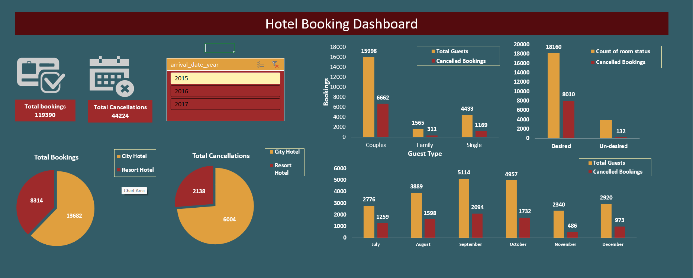

# Hotel Booking Dashboard  
---

## Project Overview  
This project presents a **Hotel Booking Dashboard** created to analyze hotel booking data from **2015–2017**.  
The dataset includes **119,390 total bookings** and **44,224 cancellations**.  

The dashboard highlights booking trends, cancellations, guest types, room preferences, and seasonal demand.  
It helps hotels understand customer behavior, reduce cancellations, and plan better for peak seasons.  

---

## Key Insights  
- **Total Bookings**: 119,390  
- **Total Cancellations**: 44,224  
- **Hotel Types**: City Hotels had higher bookings compared to Resort Hotels.  
- **Guest Type Analysis**: Couples account for the largest share of bookings, followed by Singles and Families.  
- **Room Preferences**: Most guests received desired rooms, but cancellations are still significant.  
- **Seasonality**: Bookings peak in September and October, while cancellations also rise during these months.  

---

## Tools & Technologies  
- **Visualization Tool**: Excel *  
- **Dataset**: Hotel Booking Dataset (Kaggle dataset)  
- **Charts Used**: Pie Charts, Bar Charts, KPIs, Filters, Year Selector  

---

## Dashboard Preview  
   

---

## How to Use  
1. Clone this repository:  
   ```bash
   https://github.com/MontyDevelop/Hotel-booking.git
